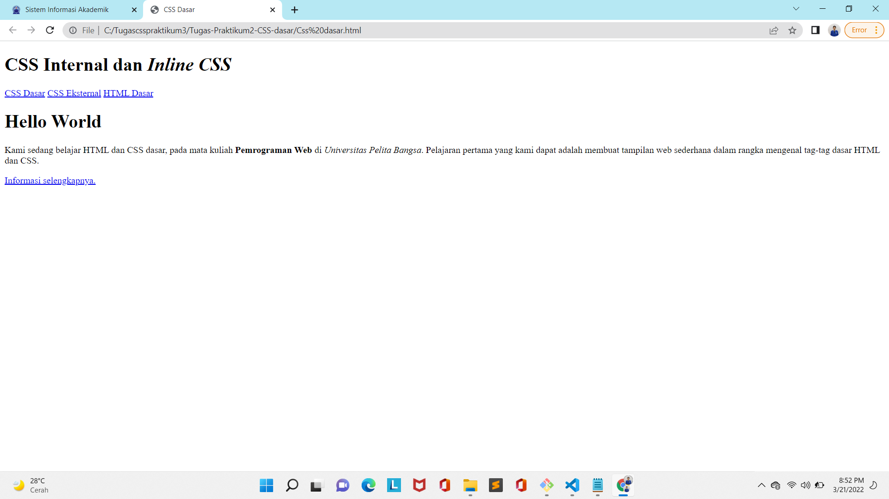
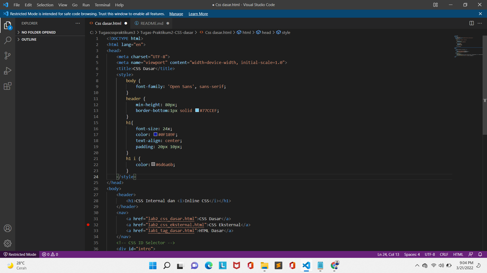
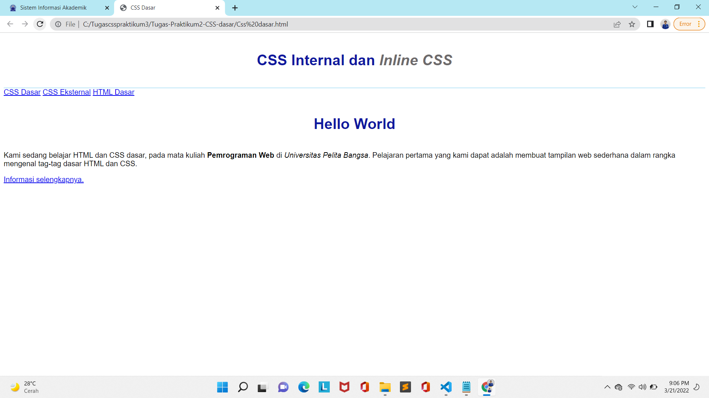
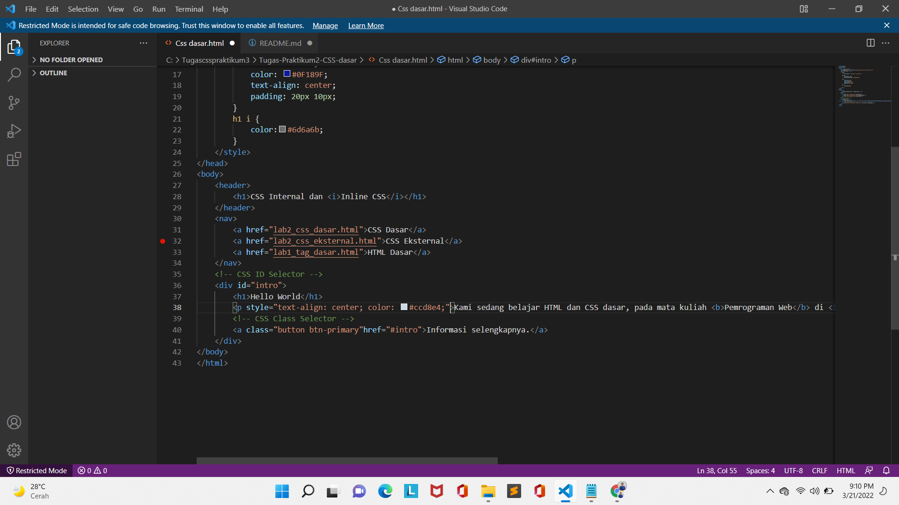
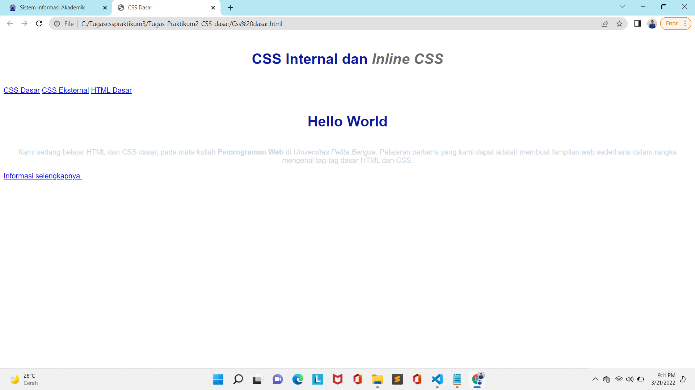
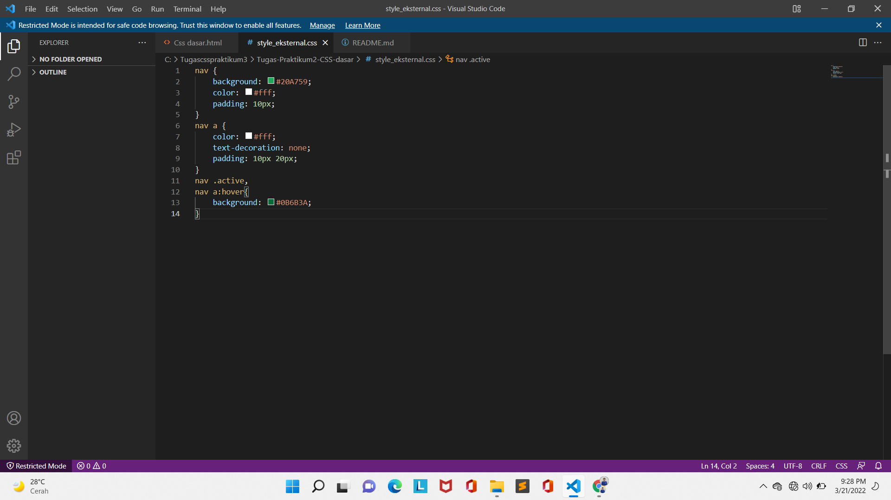
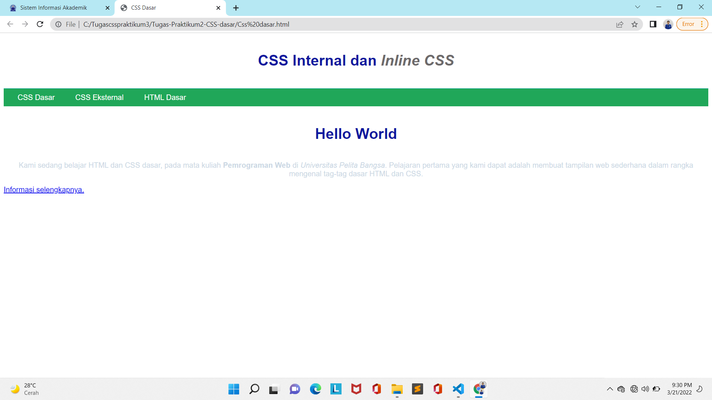
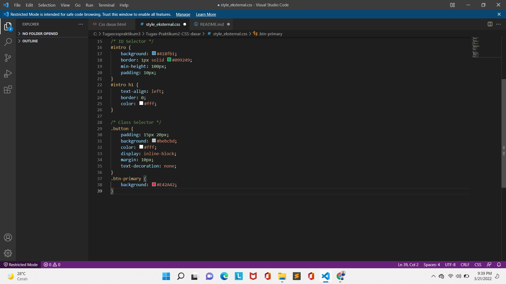
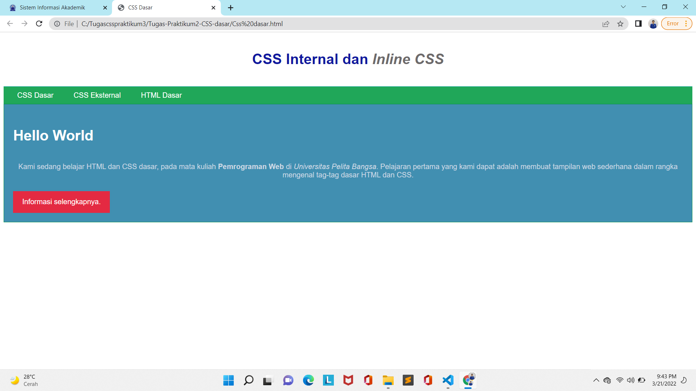

### Tugas-Praktikum2-CSS-dasar ###
## Nama : Muhammad Choeruman Syah
## Kelas : TI. 20. A. 1
## NIM : 312010031
## Mata Kuliah : Pemrograman Web

Membuat dokumen html nya

Menambahkan deklarasi CSS internal seperti berikut pada bagian head dokumen.

Menambahkan deklarasi inline CSS pada tag `
`

membuat file baru untuk deklarasi CSS

hasilnya

menambahkan CSS Selector menggunakan ID dan Class Selector.

Alhamdulillah setelah di refresh tampilannya berubah seperti ini

